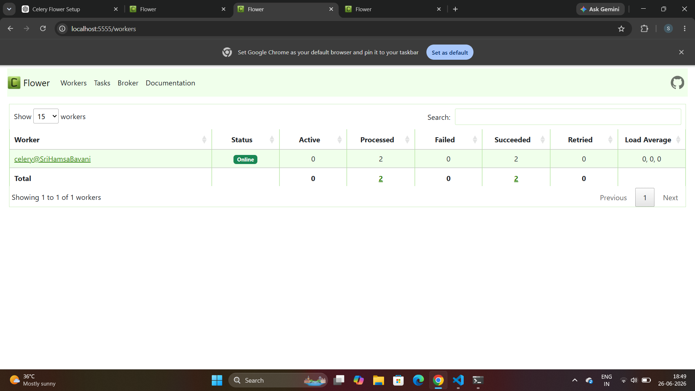
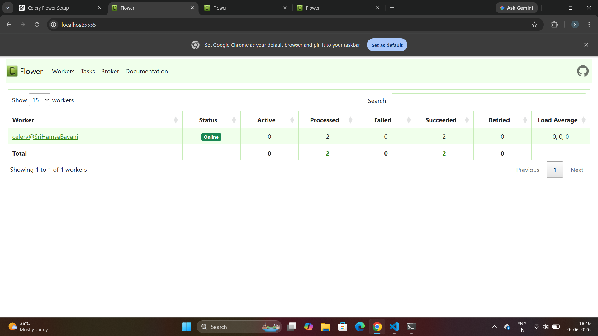
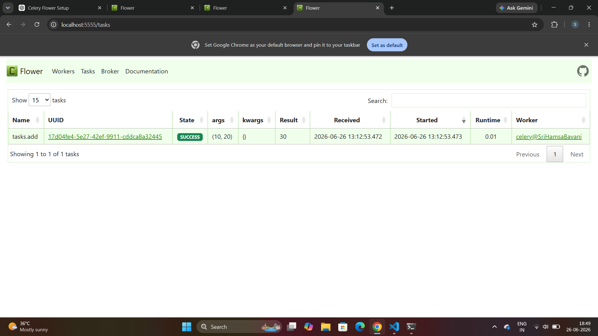

# Learn Flower (Celery Monitoring UI)

## Objective

The objective of this project is to learn how to use **Flower**, a web-based monitoring tool for Celery. Flower helps monitor Celery workers, tasks, queues, and task status in real time.

---

# What is Flower?

**Flower** is an open-source web application used to monitor and manage **Celery** tasks. It provides a user-friendly dashboard that allows developers to view running workers, monitor task execution, inspect queues, and track task status in real time.

Flower is commonly used with Celery to simplify debugging and monitor distributed background tasks through a web browser.

### Key Benefits of Flower

* Monitor Celery workers in real time.
* View active, completed, and failed tasks.
* Inspect task queues.
* Track task execution status.
* Monitor worker performance.
* Easy-to-use web-based interface.
* Helps in debugging and troubleshooting Celery applications.

---

## Prerequisites

* Python 3.x
* Celery
* Redis
* Flower

---

## Installation

Install Flower using the following command:

```bash
pip install flower
```

---

## Start Redis

```bash
redis-server
```

---

## Start the Celery Worker

```bash
celery -A tasks worker --loglevel=info
```

---

## Start Flower

```bash
celery -A tasks flower
```

---

## Open Flower Dashboard

Open your web browser and visit:

```
http://localhost:5555
```

---

## Sample Task

Example task in `tasks.py`:

```python
from celery import Celery
import time

app = Celery(
    'tasks',
    broker='redis://localhost:6379/0',
    backend='redis://localhost:6379/0'
)

@app.task
def add(x, y):
    time.sleep(15)
    return x + y
```

To execute the task:

```python
from tasks import add

result = add.delay(10, 20)
print(result.get())
```

---

# Flower UI Screenshots

## 1. Worker Status

The Flower dashboard displaying the connected Celery worker.



---

## 2. After Running the Queue

The Flower dashboard after executing the Celery task successfully.



---

## 3. Task Details

The Tasks page showing the completed Celery task, its status, arguments, and execution details.



---

## Features

* Monitor Celery workers.
* View active, completed, and failed tasks.
* Monitor task queues.
* Track task execution status.
* Inspect task results.
* Monitor worker performance.
* Web-based monitoring dashboard.
* Easy integration with Redis and Celery.

---

## Output

* Flower dashboard launched successfully.
* Celery worker connected successfully.
* Redis server connected successfully.
* Tasks were executed and monitored in real time.
* Worker status and task execution details were displayed through the Flower dashboard.

---

## Project Structure

```text
T10/
│── images/
│   ├── workers_status.png
│   ├── after_queue.png
│   └── task_details.png
│
│── tasks.py
│── README.md
│── .gitignore
```

---

## Conclusion

Flower is a lightweight and powerful monitoring tool for Celery. It provides a simple web interface to monitor workers, queues, and task execution in real time. Through this project, Flower was successfully configured with Celery and Redis, enabling real-time monitoring of background task processing. This project demonstrates how Flower can be used to improve task visibility, debugging, and overall application monitoring.
